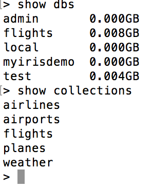
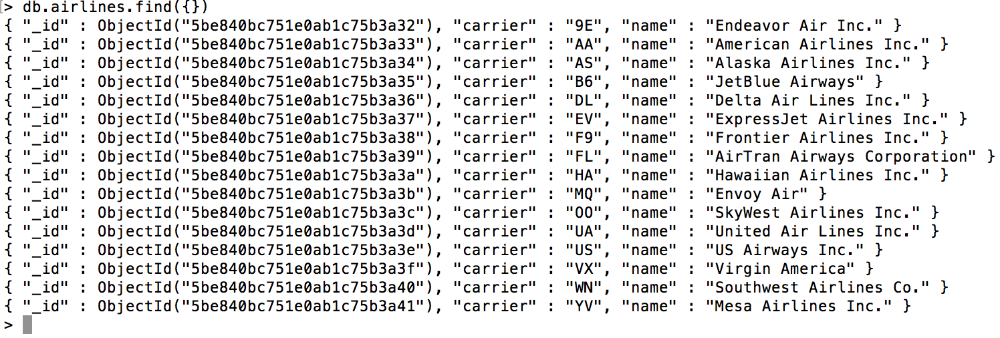

```{r setup, include=FALSE}
knitr::opts_chunk$set(echo = TRUE)
```

```{r}
library(kableExtra)
```


#NoSQL migration

The flights database will be migrated from MySQL to MongoDB. TO do this the tables in the flights database in MySQL will be read into r dataframes, which will then be exported to a MongoDB.

##MySQL

Data is stored in MySQL is a database (schema) called flights, with 5 tables:


We connect to MySQL and load all the tables in the flights database into dataframes which are added to a list.

```{r}
library(RMySQL)
```

```{r}
con <- dbConnect(MySQL(), user='root', password='123', dbname='flights', host='localhost')
tablesNamesSQL <- dbListTables(con)
tablesSQL<-list()

for(i in 1:length(tablesNamesSQL)){
  tablesSQL[[i]]<-data.frame(dbReadTable(con,tablesNamesSQL[i]))
}
names(tablesSQL)<-tablesNamesSQL
```

We inspect the dataframes to see if the data was loaded.

```{r results='asis'}
inspectDataFrameList<-function(dataFrameList) {
  cat("\n Names of data frames \n\n")
  print(names(dataFrameList))
  cat(paste("\n Summay of airlines \n\n"))
  print(summary(dataFrameList$airlines))
  cat(paste("\n Summay of airports \n\n"))
  print(summary(dataFrameList$airports))
  cat(paste("\n Summay of flights \n\n"))
  print(summary(dataFrameList$flights))
  cat(paste("\n Summay of planes \n\n"))
  print(summary(dataFrameList$planes))
  cat(paste("\n Summay of weather \n\n"))
  print(summary(dataFrameList$weather))
  cat(paste("\n Head of airlines \n\n"))
  print(kable(head(dataFrameList$airlines,n=20))) 
  cat(paste("\n\n Head of airports \n\n"))
  print(kable(head(dataFrameList$airports,n=20)))
  cat(paste("\n\n Head of flights \n\n"))
  print(kable(head(dataFrameList$flights,n=20))) 
  cat(paste("\n\n Head of planes \n\n"))
  print(kable(head(dataFrameList$planes,n=20))) 
  cat(paste("\n\n Head of weather \n\n"))
  print(kable(head(dataFrameList$weather,n=20)))  
}

inspectDataFrameList(tablesSQL)
```

##MongoDB

The databrames containing the SQL tables are stored into collections in MongoDB.

```{r}
library(mongolite)
```

```{r}
for(i in 1:length(tablesNamesSQL)){
  c<-mongo(collection = tablesNamesSQL[i],db="flights")
  c$insert(tablesSQL[[i]])
}
```

A flights database is created containing a collection for each dataframe.



Each row of data in the dataframes is stored as a document in the respective collection. Here is an example for airlines:



The data is read back into r. We read all the collections available in the flights database stored in MongoDB.

```{r}
c<-mongo(db="flights")
p<-c$run('{"listCollections":1}')
collectionsNamesMongo <- p$cursor$firstBatch$name
collectionsMongo<-list()

for(i in 1:length(collectionsNamesMongo)){
  c<-mongo(collection = collectionsNamesMongo[i],db="flights")
  collectionsMongo[[i]]<-c$find('{}')
}
names(collectionsMongo)<-collectionsNamesMongo
```

We inspect the collections to see if the data was loaded.

```{r results='asis'}
inspectDataFrameList(collectionsMongo)
```

##Verification SQL vs MongoDB

```{r}
if(tablesSQL$airlines==collectionsMongo$airlines && 
   tablesSQL$airports==collectionsMongo$airports &&
   tablesSQL$flights==collectionsMongo$flights &&
   tablesSQL$planes==collectionsMongo$planes &&
   tablesSQL$weather==collectionsMongo$weather) {
  print("Data in both databases is the same")
} else {
  print("Data is not the same in both databases")
}
```

##SQL(MySQL) vs. non-SQL(MongoDB)

Data stored in both databases can be imported to equal dataframes. But the SQL database is more conducive to operations where data from different tables needs to be related. For example using primary keys in tables and performing joins. Data in Mongo sits in collections which are not natively related, although MongoDB offers a SQL abstraction. Also, rows of data in Mongo are stored as documents with an identifier for each. This seems excessive and overweight. But the idea of collections open the option of storing documents of different kinds within the collection. This means that we can potentially store all of our dataframes in Mongo under the same collection, even as each data frame contains different columns. This is not possible in SQL, where to do this we would have to add columns for all the tables, thus creating data that is very space since columns will only be used when data for the respective table is present, and will be empty otherwise. In Mongo, event with our current setup where we have different collections for the different dataframes, if data were missing for a specific column for different rows, those columns will simply not be present in the collection. This reduces sparsity compared to SQL.

The following is a comparison table (source: https://hackernoon.com/mongodb-vs-mysql-comparison-which-database-is-better-e714b699c38b)


